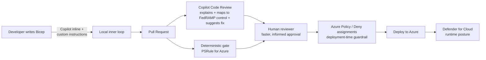

# Shift-Left Compliance: Reviewing Bicep Deployments with GitHub Copilot

> Bringing FedRAMP / NIST 800-53 governance into the pull request workflow, using
> **GitHub Copilot Code Review** as an intelligent triage-and-remediation layer
> *in front of* deterministic policy enforcement.

This repository is the demo asset for the session **"Shift-Left Compliance: Using
GitHub Copilot to Review Bicep Deployments Against Security and Regulatory
Controls."**

---

## The thesis (one sentence)

**Copilot is the shift-left _interpretation and remediation_ layer; deterministic
policy (PSRule / Azure Policy / deny assignments) remains the _enforcement and
attestation_ layer.** Copilot makes the human reviewer faster and lowers the
expertise barrier — it does **not** replace the audit-grade gate.

Copilot and the deterministic gate run **in parallel**. Copilot accelerates the
human; policy enforces the gate. Defense-in-depth — never a single point.

---

## Repository layout

| Path | Purpose |
| --- | --- |
| `.github/copilot-instructions.md` | Top-level repo instructions Copilot Code Review reads on every PR. |
| `.github/instructions/bicep-fedramp.instructions.md` | **The control catalog.** FedRAMP/NIST controls mapped to concrete Bicep properties, scoped to `**/*.bicep`. This is the attestable artifact. |
| `infra/` | **Deliberately flawed** Bicep with planted FedRAMP violations — the demo subject. |
| `infra-remediated/` | The compliant reference. What "good" looks like after remediation. |
| `ps-rule.yaml` + `.ps-rule/` | Deterministic gate (PSRule for Azure) config. |
| `.github/workflows/psrule-validate.yml` | CI job that runs the deterministic gate on every PR. |
| `docs/control-catalog.md` | Human-readable version of the control catalog (slide-ready table). |
| `docs/speaker-notes.md` | Run-of-show, demo script, Q&A prep, and limitations talking points. |

---

## The demo flow (live)

1. **Show the control catalog** (`.github/instructions/bicep-fedramp.instructions.md`) —
   compliance encoded once, applied on every PR. This is the "aha."
2. **Open a PR** that adds the flawed `infra/` Bicep.
3. **Copilot Code Review** comments inline: each finding *explains the risk*,
   *cites the FedRAMP/NIST control*, and *suggests a fix*.
4. **Apply the suggested fixes** (or pull from `infra-remediated/`).
5. **The deterministic gate (PSRule) goes green** — proving the AI triage and the
   audit gate agree.
6. **Narrate one thing Copilot got vague or wrong on purpose** — this builds
   credibility with a senior audience and demonstrates you understand the limits.

> **Verified locally:** PSRule reports **32 failures on `infra/`** and **0 on
> `infra-remediated/`** using the `Azure.Default` baseline. Reproduce with:
> `pwsh -c "Invoke-PSRule -InputPath ./infra/ -Module PSRule.Rules.Azure -Option ./ps-rule.yaml -Format File -Baseline Azure.Default -Outcome Fail"`

See [`docs/speaker-notes.md`](docs/speaker-notes.md) for the full run-of-show.

---

## Anchor controls (FedRAMP Moderate / NIST 800-53 Rev 5)

| Control | Name | Bicep manifestation |
| --- | --- | --- |
| **SC-7** | Boundary Protection | `publicNetworkAccess`, network ACLs, private endpoints |
| **SC-8(1)** | Transmission Confidentiality & Integrity | `supportsHttpsTrafficOnly`, `minimumTlsVersion` |
| **SC-28** | Protection of Information at Rest | CMK / infrastructure encryption |
| **SC-12 / SC-13** | Cryptographic Key Management | Key Vault soft-delete, purge protection |
| **AC-3 / IA-2** | Access Enforcement / Identification & Authentication | `allowSharedKeyAccess`, `enableRbacAuthorization`, `disableLocalAuth` |
| **CM-6 / AC-3** | Configuration Settings / Least functionality | `allowBlobPublicAccess` |
| **AU-2 / AU-12** | Audit Events / Audit Generation | Diagnostic settings to Log Analytics |

Full mapping with rationale in [`docs/control-catalog.md`](docs/control-catalog.md).

---

## Important framing for the audience

- This demo performs **static, PR-time review** — **no Azure deployment is
  required**, so there is no live-cloud risk or spend.
- Copilot output is **non-deterministic**. The deterministic gate (PSRule) is the
  authoritative pass/fail. Copilot's job is speed, explanation, and remediation.
- The intelligence comes from **your curated control catalog**, not the model's
  general knowledge — which is exactly what lets you *attest* to the approach.
