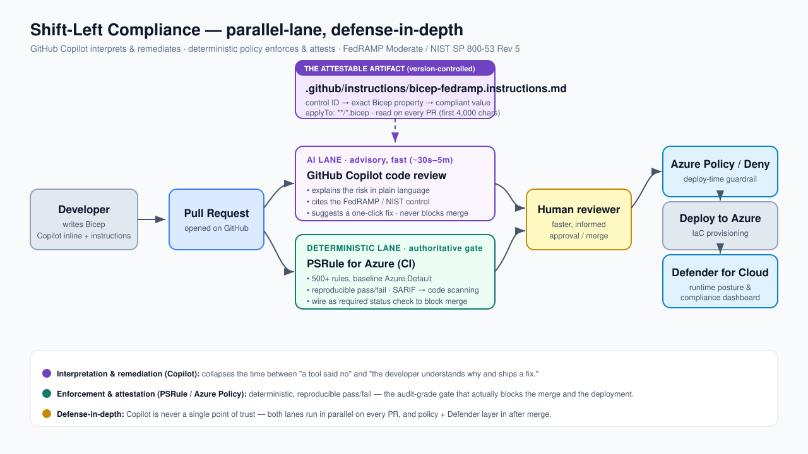
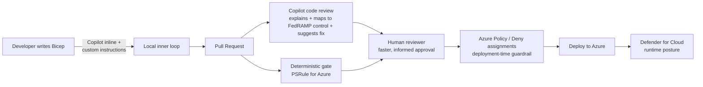

# Shift-Left Compliance: Reviewing Bicep Deployments with GitHub Copilot

> A reference implementation that brings FedRAMP Moderate / NIST SP 800-53 Rev 5
> governance into the pull request workflow, using **GitHub Copilot code review** as
> an interpretation-and-remediation layer *in front of* deterministic policy
> enforcement.

This repository demonstrates a defense-in-depth pattern for catching security and
regulatory misconfigurations in Azure Bicep at pull-request time. It pairs an
AI-assisted review layer with a deterministic policy gate, and ships both a
**deliberately non-compliant** infrastructure tree and a **remediated** reference so
the behavior can be reproduced end to end.

---

## The thesis (one sentence)

**Copilot is the shift-left _interpretation and remediation_ layer; deterministic
policy (PSRule / Azure Policy / deny assignments) remains the _enforcement and
attestation_ layer.** Copilot makes the human reviewer faster and lowers the
expertise barrier — it does **not** replace the audit-grade gate.





Copilot code review and the deterministic gate run **in parallel** on every pull
request. Copilot accelerates the human reviewer; policy enforces the gate. Neither
layer is a single point of trust.

---

## Repository layout

| Path | Purpose |
| --- | --- |
| `.github/copilot-instructions.md` | Repository-level instructions Copilot code review reads on every PR. |
| `.github/instructions/bicep-fedramp.instructions.md` | **The control catalog.** FedRAMP / NIST controls mapped to concrete Bicep properties, scoped to `**/*.bicep`. This is the version-controlled, attestable artifact. |
| `infra/` | **Deliberately non-compliant** Bicep with planted FedRAMP violations — the subject under review. |
| `infra-remediated/` | The compliant reference: the same workload after remediation. |
| `ps-rule.yaml` + `.ps-rule/` | Deterministic gate (PSRule for Azure) configuration. |
| `.github/workflows/psrule-validate.yml` | CI job that runs the deterministic gate on every PR. |
| `scripts/psrule-check.ps1` | Local convenience wrapper for running the gate offline. |
| `docs/control-catalog.md` | Human-readable mapping of each planted violation to its control and compliant value. |
| `docs/images/` | Reference-architecture and cost-of-late-feedback diagrams (SVG). |

---

## How the workflow runs

1. **The control catalog is encoded once** in
   `.github/instructions/bicep-fedramp.instructions.md` and applied automatically on
   every pull request that touches `**/*.bicep`.
2. **A pull request introduces or changes Bicep** — for example, the non-compliant
   resources in `infra/`.
3. **Copilot code review comments inline.** For each finding it explains the risk,
   cites the FedRAMP / NIST control, and suggests a concrete fix.
4. **The deterministic gate (PSRule for Azure) evaluates the same change** and
   produces a reproducible pass/fail, emitting SARIF to GitHub code scanning.
5. **A human reviewer approves with full context**, and post-merge guardrails (Azure
   Policy / deny assignments at deploy time, Microsoft Defender for Cloud at runtime)
   provide additional layers.

The remediated tree in `infra-remediated/` shows the compliant end state for every
planted violation.

> **Verified locally:** PSRule reports **32 failures on `infra/`** and **0 on
> `infra-remediated/`** using the `Azure.Default` baseline. Reproduce with:
>
> ```bash
> pwsh -NoProfile -File ./scripts/psrule-check.ps1
> ```
>
> or directly:
>
> ```bash
> pwsh -c "Invoke-PSRule -InputPath ./infra/ -Module PSRule.Rules.Azure -Option ./ps-rule.yaml -Format File -Baseline Azure.Default -Outcome Fail"
> ```

---

## Anchor controls (FedRAMP Moderate / NIST 800-53 Rev 5)

| Control | Name | Bicep manifestation |
| --- | --- | --- |
| **SC-7** | Boundary Protection | `publicNetworkAccess`, network ACLs, private endpoints |
| **SC-8(1)** | Transmission Confidentiality & Integrity | `supportsHttpsTrafficOnly`, `minimumTlsVersion` |
| **SC-28** | Protection of Information at Rest | CMK / infrastructure encryption |
| **SC-12 / SC-13** | Cryptographic Key Management | Key Vault soft-delete, purge protection |
| **AC-3 / IA-2** | Access Enforcement / Identification & Authentication | `allowSharedKeyAccess`, `enableRbacAuthorization`, `disableLocalAuth` |
| **CM-6 / AC-3** | Configuration Settings / Least functionality | `allowBlobPublicAccess` |
| **AU-2 / AU-12** | Audit Events / Audit Generation | Diagnostic settings to Log Analytics |

The full mapping, with each planted violation and its compliant value, is in
[`docs/control-catalog.md`](docs/control-catalog.md).

---

## Scope and limitations

- The review described here is **static and PR-time** — no Azure deployment is
  required to reproduce it, so there is no live-cloud risk or spend.
- Copilot code review output is **non-deterministic**. The deterministic gate
  (PSRule) is the authoritative pass/fail. Copilot's role is speed, explanation, and
  remediation, not enforcement.
- The interpretation is driven by the **curated control catalog in this repository**,
  not by a model's general knowledge — which is what makes the approach attestable.
- This pattern addresses the **technical-control configuration slice** only. It is
  not a substitute for an authorization package, System Security Plan narratives, or
  assessor judgment. Even Azure Policy regulatory compliance is, in Microsoft's own
  words, "only a partial view of your overall compliance status."

> ⚠️ **Known limit — Copilot code review reads only the first 4,000 characters of
> each instruction file** (Copilot Chat and the cloud agent do not share this cap).
> `.github/instructions/bicep-fedramp.instructions.md` is deliberately kept within
> that budget so the full catalog is applied on every PR. As the catalog grows,
> keep the highest-value controls near the top, or split it across multiple
> `**/*.instructions.md` files. Either way the **deterministic gate**, not the
> prose, remains the source of truth.

---

## Grounding & references

This approach is grounded in published Microsoft and GitHub guidance.

**GitHub Copilot code review**
- Using Copilot code review (custom instructions, 4,000-char limit, "Comment"
  reviews): <https://docs.github.com/en/copilot/how-tos/use-copilot-agents/request-a-code-review/use-code-review>
- About Copilot code review: <https://docs.github.com/en/copilot/concepts/code-review>
- Adding repository custom instructions: <https://docs.github.com/en/copilot/customizing-copilot/adding-repository-custom-instructions-for-github-copilot>

**Deterministic policy — PSRule for Azure**
- PSRule for Azure (500+ rules, `Azure.Default` baseline): <https://azure.github.io/PSRule.Rules.Azure/>
- Test Bicep with GitHub Actions: <https://azure.github.io/PSRule.Rules.Azure/quickstarts/test-bicep-with-github/>

**Azure governance, security baselines & runtime posture**
- Azure Policy — FedRAMP Moderate built-in initiative: <https://learn.microsoft.com/en-us/azure/governance/policy/samples/fedramp-moderate>
- Azure Policy overview: <https://learn.microsoft.com/en-us/azure/governance/policy/overview>
- Microsoft cloud security benchmark: <https://learn.microsoft.com/en-us/security/benchmark/azure/>
- Microsoft Defender for Cloud — regulatory compliance: <https://learn.microsoft.com/en-us/azure/defender-for-cloud/regulatory-compliance-dashboard>
- Azure Well-Architected — Security pillar: <https://learn.microsoft.com/en-us/azure/well-architected/security/>

**Standards**
- NIST SP 800-53 Rev 5: <https://csrc.nist.gov/pubs/sp/800/53/r5/upd1/final>
- FedRAMP: <https://www.fedramp.gov/>
